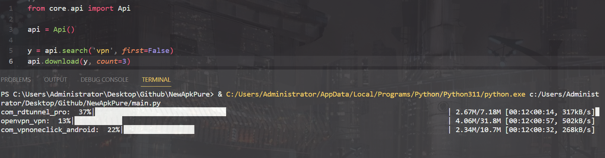

# ApkPure Wrapper 🤖

_Search and Download android application from [ApkPure](https://apkpure.com)_
______

_FYI, i'm re-create this project just because im bored😒 and also i want to learn about some library what im use in this project._<br>
_but if you want open issue or anything dont hold your self_
## Features
- Simply to use, just 1, 2, 3 and there your output 😁👍
- Fully type hinted just make sure you know how to use 😋
- Multithread request make your download and search more faster ⚡
- Pandas table output make the output more pretty ❤️
- More? soon 😁👌maybe

## Installing
for now just clone this repo and install all dependencies from requirements.txt with `pip install -r requirements.txt`

## Examples

### search application
```py
>>> api = Api()
>>> apps = api.search('vpn') #lets say this contain 10 rows data
>>> print(apps)
```

### search application
```py
>>> api = Api()
>>> apps = api.search('vpn') #lets say this contain 10 rows data
>>> print(apps.to_dict()) #return data as type dict
```

### download all data
```py
>>> api = Api()
>>> apps = api.search('vpn') #lets say this contain 10 rows data
>>> api.download(apps) #<= this will download 10 apps
```

### download only 5 data
```py
>>> api = Api()
>>> apps = api.search('vpn') #lets say this contain 10 rows data
>>> api.download(apps, count=5) #<= this will download 5 apps
    note: `count` cannot higher than lenght of rows
```
### download only specific row
```py
>>> api = Api()
>>> apps = api.search('vpn') #lets say this contain 10 rows data
>>> api.download(apps, index=[1,4,7]) #<= this will download only row 1, 4 and 7
```

## Example download output


## NOTE
i didn't test this on mobile, if this doesnt work please open issue or make pull request

## Author
Dyseo / [Dyseo](https://github.com/dyseo)
